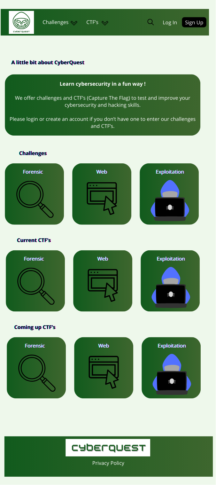
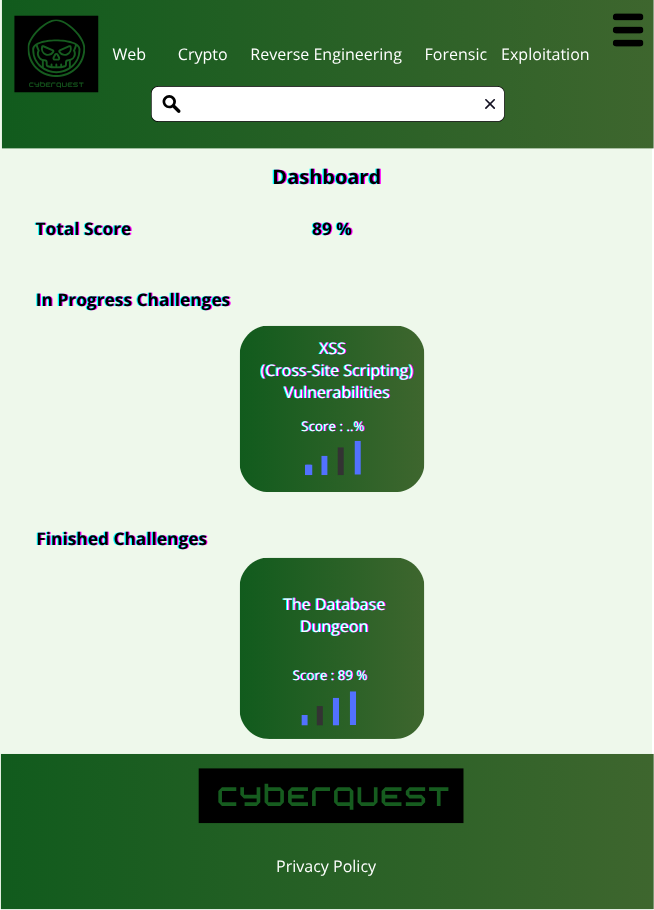
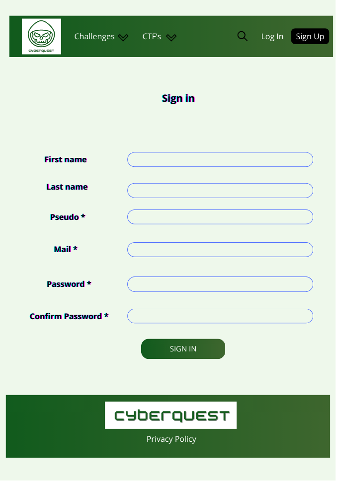
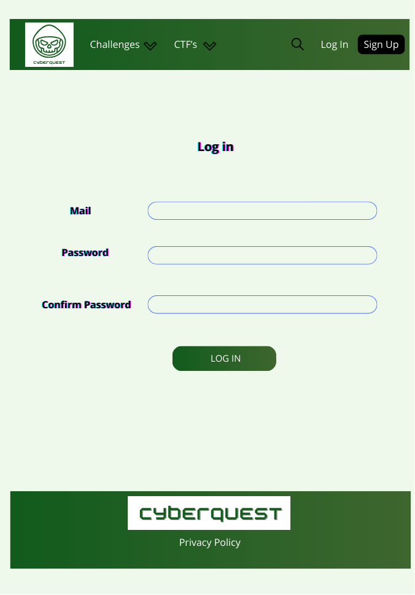

# CyberQuest - Portfolio Project for Holberton School

## What is CyberQuest ?

CyberQuest is a platform made to improve your cybersecurity skill in a fun way. The platform is inspired by famous other platforms like Root-me or Hack the Box. Challenges for multiples categories like Web, Crypto or Forensics are available.

## Mockups

This is my home page design:

After that, we can see my dashboard design:

Now, we see the Web Challenges page:

Here is my Sign Up design:

And finally my Log in design:

## Challenges faced
### Technical
I research extensively about the back and the front but didn't research about the link between front end and back end. This resulted in a lot of frustration but I managed to get through it. 
I initially wanted to use the Hack the Box API to import challenges as I didn't have the technical capacities to implement them myself. However, I didn't have time to do so and chose to implement a very simple one as an example.

### Non-technical
This project, as it contains all aspects of web developpement (design, architechture, front-end, back-end) represents a lot of work. It brought a lot of stress as I was alone and had a tight deadline.

## Screenshots from the app

Now we see the screenshots from the actual app :

Here the home page:

Now, the dashboard:

Here, the sign up page:

And finally the web challenge page, where lies a home made very simple challenge.

## Future of the platform

Here is how this app can (and will) be improved :
- Properly implemented challenges, with an API or home made challenges
- Adding of CTF challenges 
